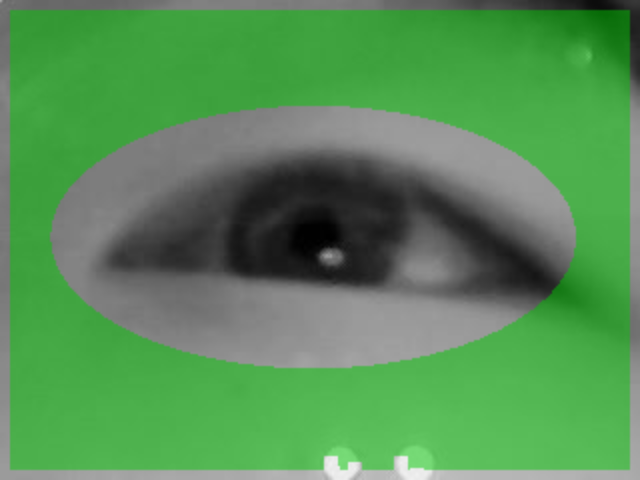

# 전시용 eye tracking: 사람마다 적응하는 반사 없는 보정 — 2026-10-02

범위는 `camera_accuracy`와 첨부 녹화다. 부착 마커·추가 센서·안경 반사를 요구하지 않는다. 조사와 오프라인 재생 실험이며 실시간 서버는 변경하지 않았다.

**권고는 공통 눈 구조 검출 + 착용한 사람의 기준 영상 + 자연 기준에 대한 상대 좌표 + 그 사람의 9점 보정/4점 검증이다.** 공통으로 학습할 것은 동공·홍채·눈꺼풀을 구분하는 능력이다. 개인별로 맞출 것은 촬영 위치·눈 크기·움직임 기준과 화면에 대한 시선 mapping이다. 한 사람의 동공 크기, 피부 위치, 안경 반사를 고정 규칙으로 쓰지 않는다.

## 1. 앞선 반사 제안 정정

사용자는 이번 밝은 반사가 안경에서 발생한다고 설명했다. 밝은 점의 위치를 시각적으로 확인한 것만으로 각막 반사라고 확인할 수는 없다. **PCCR을 전시 기본 경로로 먼저 적용하자는 제안을 철회한다.** 반사 차분의 좋은 학습 잔차는 이번 영상의 진단 결과로만 남긴다. 안경 없는 사람에게 같은 기준이 존재한다는 근거가 아니다.

앞선 수동 피부 마스크 ECC 결과도 한 사람에게 고른 영역이다. 아래에서는 동공 관측으로 주변 영역을 초기화하는 최소 실험을 추가했다. 이 역시 안경 영역을 의미적으로 분리하지 못하므로 여러 사용자에게 검증된 알고리즘으로 주장하지 않는다.

## 2. 일반 눈 형태와 사용자 적응의 역할

모든 사람을 동일한 평균 눈 타원에 맞추는 방식은 피한다. 작은 눈, 부분 가림, 속눈썹, 눈 색, 안경, 카메라 각도가 달라도 동공·홍채·눈꺼풀의 **구조를 구분하는 모델**을 사용하고, 현재 사용자 영상에서 위치와 크기를 추정한다.

구체적인 후보는 **EllSeg / EllSeg-Gen**이다. EllSeg는 가려진 윤곽 때문에 타원 피팅이 깨지는 문제를 다루며 동공·홍채의 전체 타원을 추정한다. EllSeg-Gen은 여러 데이터셋 학습과 단일 데이터셋 학습의 일반화를 비교했다. 다양한 영상 조건에는 혼합 학습이 유리한 결과가 있지만 모든 조건에서 우월하지는 않다. [EllSeg 논문](https://arxiv.org/abs/2007.09600), [EllSeg-Gen 논문](https://arxiv.org/abs/2205.01947).

저자 GitHub에는 여러 데이터셋의 가중치와 영상 평가 코드가 있다. 논문은 별도 Bitbucket 구현도 가리킨다. 현재 카메라에서 실행·성능 검증한 모델은 아니므로 다음 비교 후보로 둔다. 이미 있는 RITnet은 이번 재생에서 누락이 많았으므로 이름만 바꿔 성공을 가정하지 않는다. [저자 구현/가중치](https://github.com/RSKothari/EllSeg).

OpenEDS는 152명의 근접 눈 영상과 동공·홍채·공막 분할 자료를 제공한다. TEyeD는 일곱 head-mounted 장치와 여러 활동 조건의 동공·홍채·눈꺼풀 라벨을 포함한다. 이런 자료는 공통 검출기 평가/학습의 근거이며, 현재 카메라에서의 정확도나 전시 관람객 전체의 성공을 보장하지 않는다. [OpenEDS](https://arxiv.org/abs/1905.03702), [TEyeD](https://arxiv.org/abs/2102.02115).

눈 구조를 잘 검출해도 화면 시선은 개인별 차이가 남는다. 공통 검출기에 **현재 사람의 짧은 보정**을 결합하는 방향이 적절하다. FAZE는 소수의 개인 보정 표본으로 gaze 모델을 적응시키는 연구다. 연구의 촬영 도메인이 이 IR 근접 카메라와 다르므로 바로 가져올 모델이라기보다 개인 적응의 설계 근거로 본다. 지금은 기존 9점 회귀를 유지하는 것이 작고 검증하기 쉽다. [FAZE 논문](https://arxiv.org/abs/1905.01941).

## 3. Optical flow로 상대 보정하는 방법

### 동공 flow와 기준 flow를 구분한다

현재 `TemporalOrlosky`의 동공 주변 flow는 다음 검출 위치를 제안하거나 검출 실패를 잠깐 보완한다. 이것에는 실제 안구 운동이 포함된다. **이 이동을 카메라 흔들림이라고 빼면 정상 시선 이동도 제거한다.**

움직임 보정에는 동공·홍채·움직이는 중앙 눈꺼풀을 제외한 주변 피부/눈꼬리의 기준이 별도로 필요하다. 얼굴의 여러 자연 패치 중 카메라 이동을 잘 나타내는 영역을 자동 선택하는 연구가 있다. 원 연구는 genetic algorithm과 ROI 사이의 co-correlation을 사용했으며, 아래 최소 실험은 그 알고리즘을 구현한 것이 아니다. 참고할 practice는 한 위치를 모든 사람에게 고정하지 않고 **그 사람에게 추적 가능한 자연 기준을 선택한다**는 점이다. [Karmali & Shelhamer, 자연 ROI 선택](https://pubmed.ncbi.nlm.nih.gov/18835407/).

제안하는 흐름:

1. 착용 후 중앙 1점에서 실제 영상을 수집한다. 눈 구조의 위치, 주변 패치, 좋은 동공 관측을 기준으로 저장한다. 지금의 1.6초 안내만으로는 기준이 생기지 않는다.
2. 눈 구조 마스크 밖의 여러 패치를 LK로 추적한다. 앞뒤 추적 오차, 분포, 패치 간 이동 일치도를 확인한다. 밝은 반사와 안경테는 얼굴 기준으로 채택하지 않는다.
3. 짧은 구간에서는 LK를 사용하고, 같은 기준 영상에 ECC/패치 정합을 다시 수행하여 누적 오차를 확인한다. 정합 실패 시 오래된 기준을 계속 빼지 않는다. [OpenCV LK/ECC API](https://docs.opencv.org/4.x/dc/d6b/group__video__track.html).
4. 이동 변환 `T`가 신뢰될 때 `T`의 역변환으로 현재 동공을 처음 사용자 좌표계에 돌린 뒤 개인 회귀에 넣는다. 평행이동이면 `p_corrected = p_current - translation`이다.
5. 순수 평행이동부터 비교한다. 카메라 roll/거리 변화는 회전·scale이 필요할 수 있지만, 이를 실제 움직임 자료로 검증한다. 표정 때문에 패치들이 서로 다르게 움직이면 단일 변환을 강제하지 않는다.

눈 카메라의 모든 픽셀에 dense flow를 걸고 중앙값을 빼는 방식은 권하지 않는다. 가까운 영상에서 눈이 큰 비중을 차지하므로 안구 운동/깜빡임이 공통 움직임을 지배할 수 있다. 영상 무늬 자체가 부족하면 dense flow도 없는 정보를 만들어 주지 못한다.

### 이번 영상에서 추가 시험한 결과

두 번째 중앙 주시 중의 560번 프레임을 기준으로 이후 420프레임을 평가했다. 첫 동공 중심·지름으로 눈 영역을 넓게 제외하고 포화된 밝은 영역도 제외했다. 마스크 위치를 목표 좌표나 9점 잔차에 맞춰 선택하지 않았다. 기존 OpenCV와 `routes.tracked_translation`, 기존 회귀 특징을 재사용했다.

| 기준 추정 | 이동값 확보 / 420 | 9점 학습 최대 잔차 | 한 점 제외 최대 오차 | 관찰 |
|---|---:|---:|---:|---|
| 원래 절대 동공 | 해당 없음 | 0.19517 | 0.94790 | 원래 실패 |
| 처음 기준 영상에 직접 LK | 153 | 계산하지 않음 | 계산하지 않음 | 후반 점들 표본 소실 |
| 직전 유효 영상으로 갱신하는 LK 누적 | 408 | **0.06885** | 0.40357 | 학습 개선, 누적 오차 검사 필요 |
| 처음 기준 영상에 ECC, 자동 주변 마스크 | 420 | **0.05412** | 0.16744 | LK보다 오래된 기준 정합에 유리한 결과 |

직접 LK의 최소 특징점 수를 10→4로 낮춰도 확보 수는 153으로 같았다. 특징점 개수 제한만 풀면 해결되는 문제가 아니다. LK 누적의 **정확히 같은 프레임**에 절대 동공 좌표를 넣으면 최대 잔차 0.19518이다. ECC는 원래 수집 표본을 전부 유지했다.

LK/ECC 보정 후 점별 구간 중심에 대한 p90 산포는 각각 약 0.57–1.87 / 0.78–1.67 센서 px다. 이 산포에는 검출 오차·실제 안구 운동·기준 추정 오차가 섞여 있다. 목표 전환을 제외한 수집 구간 통계이며 실제 시선 정확도는 아니다. **한 점 제외 오차도 둘 다 0.12보다 크므로 학습 잔차 개선만으로 합격이라 할 수 없다.**



초록 영역은 자연 피부만을 확인한 정답 마스크가 아니다. 현재 실험은 안경 렌즈 영역을 완전히 분리하지 못한다. 첫 동공 크기로 눈을 제외하는 근사이므로 큰 동공/작은 눈에서 과도하게 제외하거나 작은 동공/큰 눈에서 눈 일부를 포함할 수 있다. 운영에서는 눈 구조/안경 영역 분리와 패치 동의 검사가 필요하다.

모든 결과는 **한 사람·안경 착용·기록된 동공을 재사용한 학습 재생**이다. 8번 점은 새 경계 검출 4개라는 기존 문제가 남는다. 자연 기준의 실제 이동 정답, 안경 없는 영상, 독립 4점 검증은 없다. 알려진 (+3,−3) 센서 px 합성 이동에서는 LK 추정 오차 약 0.00011px를 assert로 확인했지만, 실제 회전·깜빡임·동공 검출까지 검증한 결과가 아니다.

## 4. 다른 반사 없는 방법

| 방법 | 역할 | 이 장치에서의 판단 |
|---|---|---|
| 눈꼬리 기준 | 동공을 눈의 위치·방향·크기에 대한 상대 좌표로 표현 | 두 눈꼬리가 보이면 유망. 재검출할 수 있어 flow 누적 drift를 점검할 수 있음 |
| pye3d / 3D 안구 모델 | 여러 좋은 동공 타원에서 안구 위치·광학축을 추정하고 위치 변화를 적응 | 이미 있는 경로를 비교. 카메라 내부 파라미터와 가림 대응부터 검증 |
| Grip | glint 없이 headset slippage에 대응하는 gaze 추정 | 연구 근거가 있음. 현재 설치된 Python 경로처럼 바로 실행 가능한 구현은 확인하지 못함 |
| 학습된 영상 정렬 + gaze 회귀 | 다양한 착용 이동을 학습하여 영상 입력을 정렬 | EST-Gaze/KaleidoEye가 구체적인 최근 후보. 이 장치의 실행 모델·성능은 미검증 |
| 전시 중 알려진 목표로 짧은 drift 보정 | 재착용/큰 이동 후 사용자 mapping을 확인·갱신 | 화면에 실제 보여준 중앙 목표를 이용. 사용자가 봤다고 가정해 임의 커서 위치로 스스로 학습하지 않음 |

**눈꼬리:** 2024년 연구는 눈꼬리 2D 이동으로 머리 이동에 따른 시선 오차를 별도 회귀했다. 우리 영상에 그대로 적용한 결과는 아니다. 제안하는 최소 대안은 두 눈꼬리 중점, 방향, 거리로 동공 좌표를 정규화한 뒤 개인별 9점 mapping을 학습하는 것이다. 눈꼬리가 가려지거나 표정으로 변형되면 무효 처리한다. [Banks 등](https://pubmed.ncbi.nlm.nih.gov/38888820/).

**3D/Grip:** pye3d는 과거의 고품질 동공 관측과 서로 다른 시간 범위의 안구 모델을 사용한다. 잘못된 2D 타원과 임의 초점거리에서 정확도를 보장하지 않는다. Grip은 추가 glint나 stereo 없이 slippage에 대응하는 연구다. 별도 2020 비교 연구에서도 Grip은 움직임에 상대적으로 강했지만 다른 tracker보다 sample-to-sample 산포가 큰 결과를 보였다. **움직임 보상과 jitter는 별도로 평가해야 한다.** 이 과거 연구의 Pupil 3D 성능을 현재 설치 버전의 성능으로 단정하지도 않는다. [pye3d 공식 설명](https://docs.pupil-labs.com/core/developer/pye3d/), [Grip](https://portal.research.lu.se/en/publications/get-a-grip-slippage-robust-and-glint-free-gaze-estimation-for-rea/), [slippage 비교 연구](https://pmc.ncbi.nlm.nih.gov/articles/PMC7280360/).

**학습된 정렬:** KaleidoEye/EST-Gaze는 착용 이동을 포함한 데이터와 eye-edge 기반 입력 정렬을 제안한다. 저자 페이지는 Dataset을 coming soon으로 표시한다. 현재 카메라에서 실행 가능한 가중치·실행 성능을 확인한 상태는 아니다. 당장 새 end-to-end 학습을 시작하기보다 실제 이동 검증 조건과 영상 정렬 설계를 참고한다. [저자 프로젝트](https://lency-xx.github.io/Kaleidoeye/).

홍채 중심도 안구 회전에 따라 움직인다. `동공−홍채 중심`을 고정 피부 기준의 대체물로 단순 사용하면 시선 신호를 줄일 수 있다. 홍채는 동공 오인식 검사, 가림 처리, 3D 기하의 보조 관측으로 먼저 사용하는 편이 검증하기 쉽다. 현재 영상에서 홍채 중심 차분의 시선 정확도를 측정한 것은 아니다.

## 5. Robustness를 코드와 전시 흐름에서 확보하는 순서

1. **수집 표본부터 신뢰 가능하게 한다.** 새 동공 경계 관측과 flow 보완을 기록/수집에서 구분한다. 안정된 예측이 정답 표본으로 누적되지 않도록 하고, 관측이 부족한 점은 필요한 표본이 모일 때까지 수집한다. 마지막 한 프레임 실패와 전체 표본 부족도 다른 사유로 표시한다.
2. **중앙 1점에서 현재 사람의 기준을 만든다.** 이전 사람의 ROI, 동공 크기 이력, flow, 3D 모델, 회귀 mapping을 다음 사람에게 넘기지 않는다. 카메라 자체의 내부 파라미터는 장치 설정으로 유지한다.
3. **자연 기준 LK + 기준 영상 재정합을 별도 경로로 비교한다.** 기존 동공 검출기를 유지하고 입력 기준만 바꾸어 효과를 분리한다. 반사를 검출해야 시작되는 조건은 두지 않는다. 큰 이동/재착용 후에는 새 기준과 개인 보정을 확보한다.
4. **공통 구조 검출기를 비교한다.** EllSeg 계열과 현재 경로를 동공 중심, 동공/홍채 혼동, 가림, 누락, 처리 시간으로 평가한다. 이 녹화의 학습 잔차만 낮추도록 모델·전처리를 골라서는 안 된다.
5. **표현 상태를 구분한다.** 실제 관측, 짧은 예측, 소실, 재획득을 분리한다. 예측의 허용 시간을 frame 수가 아닌 관측 후 경과 시간으로 정한다. 깜빡임 중 오래된 시선을 새 측정으로 표시하지 않고, 재획득 시 현재 경계와 기준이 맞는지 확인한다.
6. **필터는 그 뒤에 조정한다.** 고정 주시에서는 jitter를 줄이되 정상 saccade에서는 반응을 유지한다. smoothing으로 기준 drift를 덮거나 속도 제한으로 정상 눈 움직임을 막지 않는다. 새 모델/예측 좌표계로 바꿀 때 기존 mapping을 그대로 쓰지 않는다.

## 6. 전시용 합격 기준과 남은 데이터

아래는 연구 결과가 아니라 이 장치에 제안하는 시험 계획이다.

- 개발에 쓰지 않은 사람으로 시험한다. 최소 파일럿은 서로 다른 10–20명 정도로 시작하되 이는 모든 눈 형태를 대표하는 보장이 아니다. 안경 유무, 작은 눈/부분 가림, 속눈썹, 눈 색, 착용 위치 차이를 포함한다. 동일 사람의 인접 프레임을 무작위로 나눈 결과로 사용자 일반화를 주장하지 않는다.
- 한 사람마다 새 1→9→4를 실행한다. 독립 4점 모두 현재 기준 ≤0.12를 확인하고 첫 시도 성공률, 재시도 수, 보정 시간을 기록한다. 기준 0.12를 통과하기 쉽도록 완화하지 않는다.
- 같은 목표를 반복 주시하여 고정 주시 산포/RMS, 시간에 따른 bias drift를 따로 기록한다. 정상 목표 전환은 오검출 jump 통계에서 분리하고 전환 후 반응 지연을 측정한다.
- 말하기·눈썹 움직임·자연스러운 작은 착용 흔들림·깜빡임 전후에 독립 목표 오차, 누락 시간, 재획득 시간, 기준 소실 감지 여부를 측정한다. 실제 움직임 시험과 단순 영상 평행이동 시험은 구분한다.
- 여러 사람의 대표 프레임에 동공/홍채/눈꺼풀 라벨을 마련한다. 검출 채택률은 정확도가 아니며, 가려진 중심은 불확실성을 표시한다. 사람별 최악 구간도 보아 평균으로 실패를 숨기지 않는다.

머리에 착용한 눈 카메라 하나로 눈↔카메라의 상대 이동은 추정할 수 있지만, 외부 화면에 대한 모든 머리 움직임을 관측할 수는 없다. 전시가 외부 화면의 절대 위치를 요구한다면 이 한계와 사용 자세의 허용 범위를 구분해야 한다. 이것은 입력 관측의 한계이며 smoothing이나 optical flow만 추가해서 없어지지 않는다.

## 재현

```sh
camera_accuracy/.venv/bin/python camera_accuracy/diagnostics/markerless/flow_research.py \
  /Users/chanwoo/Downloads/20261002T071853Z-0058e7f6
```

[실험 코드](diagnostics/markerless/flow_research.py), [수치·동일 표본 기준선·구간 산포](diagnostics/markerless/flow-results.json). 알려진 이동 self-check를 포함하며 새 의존성은 추가하지 않았다. 운영 tracker/서버 변경과 여러 사용자 검증은 아직 수행하지 않았다.
