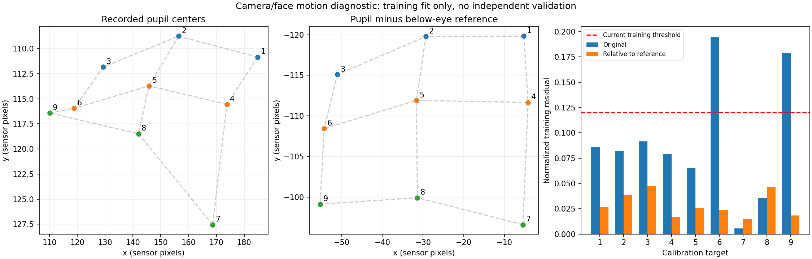

# 2026-10-02 16:18 녹화: 1→9→4 실패 진단

대상은 첨부된 `20261002T071853Z-0058e7f6`의 AVI, 프레임 sidecar, tracking JSONL, metadata와 현재 `camera_accuracy` 코드다. 기존 문서는 과거 실험의 자료로만 사용했다. 실행 코드와 기존 수정 사항은 변경하지 않았다.

후속 조건: 부착 마커는 사용하지 않는다. 사용자는 밝은 반사가 안경에서 생긴다고 설명했다. 반사를 공통 기준으로 사용하는 제안은 철회하고 [전시용 robustness 후속 조사](EXHIBITION_ROBUSTNESS_20261002.md)에서 일반 눈 구조와 반사 없는 상대 보정을 비교했다. 아래 밝은 두 점의 실험은 이 영상의 진단 자료이며 피부/안구의 실제 이동 정답이 아니다.

**이번 실패에서 가장 유력한 문제는 영상의 절대 동공 좌표에 상대 이동이 섞이는 것이다. 짧은 구간에서 잘 추적해도, 9개 점을 수집하는 동안 좌표 기준이 달라질 수 있다. 반사 없는 자연 무늬 정합에서도 9점 잔차가 개선됐지만, 실제 카메라/피부 이동 정답과 별도 4점 관측은 없다. 가림·반사에 따른 중심 편향과 flow 표본의 취급 문제도 확인됐다.**

## 1. 실제로 어디서 실패했나

- 첫 시도: 1번 점에서 raw p90 0.08796으로 흔들림 검사 실패. 재시도는 22/24프레임, p90 0.01444였지만 수집 종료 순간 tracking이 false여서 실패했다. `server.py:195`는 충분한 표본이 있어도 마지막 tracking 상태가 false면 동일한 “유효 프레임 부족” 메시지를 낸다.
- 두 번째 시도: 9개 점 모두 표본 수와 구간 흔들림 조건을 만족했다. 그러나 전체 9점의 2차 회귀 최대 잔차가 **0.19517 > 0.120**으로 실패했다. 최대 잔차는 6번, 다음은 9번(0.17881)이다. 잔차가 가장 큰 점이 원인인 점이라는 뜻은 아니다.
- **독립 4점 검증은 한 번도 실행되지 않았다.** 이번 자료로 4점 정확도를 측정하거나 실패율을 계산할 수 없다.
- 설계행렬 조건수는 7.448로 현재 제한 100보다 충분히 작다. 단순한 회귀 행렬의 수치 불안정이 주원인은 아니다. 한 점 제외 재학습 최대 오차는 오프라인 계산상 0.948로, 학습 점에 맞추기만으로 일반화를 기대하기도 어렵다.

첫 중앙 1점은 `web/app.js:222`의 1.6초 주시 안내다. 좌표 영점이나 움직임 기준을 실제로 수집하는 단계가 아니다. 2D 경로의 ready도 동공 지름 이력 12개를 확보했다는 뜻이지 시선 모델이 검증됐다는 뜻이 아니다.

## 2. 가장 강한 근거: 같은 동공 관측에서 기준 이동을 빼면 관계가 복구된다

현재 D 출력은 `routes.py:194`의 `pupil_center_2d`다. 센서의 동공 x/y를 정규화하고 화면 좌표로 회귀한다. 눈이 돌아가서 동공이 움직였는지, 카메라와 얼굴이 상대적으로 움직여 영상 전체가 이동했는지 구분할 기준이 없다. 이번 metadata에서는 `compensate_motion=false`다.

두 번째 시도의 1번→9번 수집 동안 눈 아래 밝은 두 표식의 중심 중앙값은 센서 좌표 약 `(190.36,230.71)`에서 `(165.32,215.50)`으로 움직였다. 영상에서도 눈 주변 위치가 변한다. 이것을 순수한 카메라 흔들림이라고 단정할 수는 없지만, 절대 영상 좌표를 같은 기준으로 비교할 수 없는 신호다.

특히 화면 오른쪽의 6번→9번은 목표 y가 0.5→0.9로 바뀌었는데 동공 y 중앙값은 **115.96→116.42, 겨우 0.46 센서 px** 움직였다. 아래 표식 y는 같은 동안 약 **9.21px 위로** 움직였다. 표식에 대한 상대 동공 y로 계산하면 약 9.68px 아래로 움직인다. 실제 시선에 따른 움직임과 공통 영상 이동이 상쇄되는 패턴이다.

동공 검출 결과, 채택한 프레임, 목표 좌표, 회귀 항 수를 그대로 두고, 프레임별로 `동공 중심 - 눈 아래 두 표식의 평균 중심`만 사용해 다시 계산했다.

| 입력 | 최대 9점 학습 잔차 | 한 점 제외 재학습 최대 오차 |
|---|---:|---:|
| 기록된 절대 동공 중심 | 0.19517 | 0.94790 |
| 상대 동공 중심, 표식 추출 임계값 200 | **0.04740** | 0.27272 |
| 상대 동공 중심, 임계값 210 | **0.04433** | 0.23967 |

두 임계값 모두 각 점의 원래 유효 표본을 전부 사용했다: `24,24,23,23,24,23,21,13,24`. 불리한 프레임이나 점을 제거한 결과가 아니다. 목표 좌표로 표식을 선택하거나 회귀 계수를 조정하지도 않았다.



**이 결과는 이동 기준 확보가 우선이라는 진단 근거이지, 해결된 시선 모델이 아니다.** 표식의 물리적 부착/투영 원리는 자료에 없고, 보이는 밝은 원형 영역을 경험적으로 찾았다. 학습 잔차만 개선했으며 독립 4점 자료도 없다. 밝은 두 점을 그대로 운영용 움직임 보정 기준으로 사용해서는 안 된다. 한 점 제외 오차도 여전히 크다.

기존 피부 이동 보정의 추정값은 전체 **14/1,123프레임**에서만 존재했다. `routes.py:294`의 고정 상·하부 ROI와 특징점 10개 조건은 이번 영상에서 지속적인 기준을 제공하지 못한다. 표식은 수집 초반 영상 하단 가까이에 있어 고정 마스크 바깥에 걸릴 수도 있다. 옵션을 켜면 기준 소실로 표본을 차단하는 구조이므로, 단순히 보정 옵션을 켜는 것을 해결책으로 권하지 않는다.

## 3. 동공/홍채 정확도

현재 D는 동공과 홍채를 함께 검출하는 알고리즘이 아니다. 작은 어두운 영역을 찾고, 크기·대비·곡률·타원 지지율·직전 위치로 동공 후보를 선택한다. 홍채의 중심/경계 정답을 출력하거나 정확도를 평가하지 않는다.

이번 9점의 동공 장축 중앙값은 센서 기준 약 28.9–37.9px다. 과거 기록의 지름 2배 전환처럼 “대부분의 점에서 동공 대신 큰 홍채를 잡았다”는 현상은 이번 9점에서 확인되지 않는다. 대표 프레임의 타원도 대체로 작은 동공 주변에 있다. 이번 실패 전체를 홍채 오인식 하나로 설명하면 이동 문제를 놓친다.

그러나 아래쪽 주시에서는 동공 아래 경계가 눈꺼풀에 가리고, 강한 반사가 검은 영역을 끊는다. `visible_arc()`는 곡률 필터이며 눈꺼풀/반사/동공을 의미적으로 구분하지 않는다. 원래 Orlosky의 5×5 dilation 두 번도 남아 있어 윤곽 크기와 가림 부근 형상이 바뀐다. 타원 중심 편향의 정확한 양은 수동 정답이 없어 측정하지 못했다.

confidence는 정답 대비 정확도가 아니다. shape/arc 지지율이 높다는 뜻에 가깝다. flow 보완에는 고정값 0.70을 준다. 따라서 confidence 0.98을 동공 정확도 98%로 읽어서는 안 된다.

RITnet 대표 프레임 분할에서도 실제 검은 동공 영역이 비거나 작게 분할되는 사례가 보인다. 현재 가중치·320×240 추론·전처리·윤곽 후처리 전체를 이 카메라 도메인에서 검증해야 한다. 모델 이름만 바꾸는 것으로 해결됐다고 볼 근거가 없다.

영상 근거: [수집별 원영상/타원](diagnostics/20261002T071853Z-0058e7f6/capture-contact-sheet.jpg), [아래쪽 주시 확대](diagnostics/20261002T071853Z-0058e7f6/eye-crops-2.jpg), [RITnet 분할](diagnostics/20261002T071853Z-0058e7f6/ritnet-segmentation.jpg).

## 4. 시간적 일관성과 robustness

기록상 tracking 채택은 **1,032/1,123 = 91.9%**다. 이것은 정확도/recall이 아니라 코드가 좌표를 받아들인 비율이다. 그중 검출+flow 837, 일반 검출 120, flow만으로 보완 75프레임이다.

8번 점은 17프레임 중 13프레임을 채택했다. **새 윤곽 검출 4개 + flow 보완 9개**로 구성됐지만, p90 0.01381로 안정적이라고 통과했다. flow는 이전 타원의 중심을 옮기며 축과 각도를 상속한다. 패치 상관과 대비가 좋다는 사실은 새 동공 경계를 다시 측정했다는 뜻이 아니다. `predicted=false`와 고정 confidence 0.70이 붙어 `server.py:168`에서 보정 표본에 함께 들어간다. flow 표본을 빼면 이 점은 현재 최소 12개 조건을 만족하지 않는다.

전체 인접 유효 쌍은 996개이며 32 처리 px(16 센서 px) 초과 이동은 20번이다. **정상적인 목표 전환/급격한 안구 운동도 포함하므로 전부 오검출 점프로 분류하지 않았다.** 두 번째 9점의 각 수집 창에서는 인접 채택 프레임의 최대 이동이 센서 약 1.6–4.2px였다. 문제는 “매 프레임 큰 점프만 발생한다”보다 “각 구간은 부드러워도 시간이 지나면 기준이 달라진다”에 가깝다.

현재 raw p90 제한 0.08은 2D y 방향에서 **9.6 센서 px**까지 허용한다. 그런데 이번 가운데 열의 위→아래 동공 y 범위 전체는 약 9.72px다. 고정 raw 임계값이 이번 실제 시선 변화량에 비해 매우 느슨하다. 안정적으로 잘못된 위치를 잡거나 작은 기준 이동이 생겨도 통과할 수 있다.

출력 smoothing은 보정에 사용하지 않는다. `server.py:169`는 raw를 수집하고, `:172`의 Stabilizer는 모델 활성화 후 화면 출력에만 적용된다. smoothing 값을 늘려도 이번 9점 회귀 실패는 해결되지 않는다. 활성화 이후에는 검출 실패 한 프레임에도 필터를 reset하므로 재획득 첫 출력이 새 좌표로 바로 시작하는 위험도 있다. 이 기록은 모델이 활성화되지 않아 그 화면 점프를 실측한 자료는 아니다.

처리 간격 중앙값 48.78ms, p99 66.27ms, 최대 249.44ms다. 실제 처리율은 약 19.4FPS이며 장치 보고값 120FPS와 다르다. 처리 시간 중앙값은 13.8ms였다. 시간 간격은 JSONL로 분석했고 AVI의 명목 20FPS 재생 시각으로 평가하지 않았다. 저프레임률은 급격한 안구 운동 관측에 불리하지만, 이번 규칙적인 점간 왜곡의 주원인이라는 근거는 없다.

## 5. 검출기 교체 실험

기존 `compare_detectors`로 첨부 영상 전체를 재생했다. 보정 활성화 플래그는 재생했지만, 실행 중 reset/수동 seed/녹화 전 검출 이력까지 복원한 시험은 아니다. 각 경로의 기본 설정이며 ROI·지름 범위도 서로 다르다. 손실 압축 영상의 재처리이므로 기록 당시 D 출력과도 차이가 있다. 아래 채택 수로 검출 정확도 순위를 매기지 않는다.

| 경로 | 품질 조건 이상 채택 / 1,123 | 인접 유효 쌍 | 32 처리 px 초과 이동 | 검출 처리 중앙값 |
|---|---:|---:|---:|---:|
| D / orlosky-flow | 1,017 | 974 | 16 | 7.08ms |
| A / orlosky-stable | 941 | 865 | 22 | 3.59ms |
| PuReST | 827 | 711 | 48 | 0.54ms |
| Pupil 2D | 524 | 367 | 13 | 1.15ms |
| RITnet | 267 | 130 | 2 | 49.35ms |

이번 재생에서 모든 경로는 최소 한 수집 창의 표본 부족 또는 raw 흔들림으로 9점 학습 재생을 통과하지 못했다. RITnet의 점프가 적은 것은 누락이 많다는 사실과 함께 봐야 한다. 이는 비교 설정에서의 실패이며, 모든 튜닝 가능성을 소진했다는 뜻은 아니다. 3D 옵션이 자동으로 해결한다는 시험 결과도 없다.

## 6. 해결 우선순위

1. **절대 동공 중심에서 영상 자체의 자연 기준에 대한 상대 좌표로 바꾸는 실험을 먼저 한다.** 눈 바깥 자연 무늬의 LK/ECC와 눈꼬리 기준을 비교하고, 착용한 사용자마다 기준 영상을 확보한다. 안경 반사 후보는 기본 기준에서 제외한다. 이동 모델은 처음에는 평행이동으로 제한하되 회전·거리 변화 조건은 별도 검증한다. 동공과 함께 움직이는 홍채 중심을 고정된 피부 기준처럼 빼지 않는다.
2. **실측 검출과 flow 보완을 보정에서 구분한다.** flow는 화면 연속성과 다음 검출 위치 제안에 사용한다. 보정/검증은 충분한 새 동공 경계 관측을 요구하고, 해당 점이 부족하면 수집 시간을 연장하거나 재시도한다. 표본 세부 로그에 출처·가림·실측 나이를 남긴다. flow 상태가 이미 로그에 있으므로 새 추적기부터 만들 필요는 없다.
3. **고정 raw p90 대신 시선 변화량에 맞는 안정성 검사와 반복 기준점을 쓴다.** 중앙 1점에서 실제 기준을 기록하고 각 행 뒤 중앙 재주시로 drift를 확인한다. 수집 종료 순간 한 프레임 실패와 전체 표본 부족을 다른 사유로 표시한다. 9점 전체 회귀 실패 시 마지막 점만 반복 수집하면서 앞의 8점을 계속 유지하는 방식은 이동한 기준을 섞을 수 있으므로 전체 재수집 또는 기준 일치 확인이 필요하다.
4. **가림·반사에 따른 중심 편향을 정답 프레임으로 측정한다.** 이번 영상에서 정면·좌우·아래·반사·깜빡임·재획득을 포함한 100–200프레임의 동공 중심과 보이는 경계를 라벨링한다. 가려진 전체 타원은 불확실성 표시를 따로 둔다. 동공 중심 오차, 홍채/눈꺼풀 오인식, 누락률을 먼저 비교하고, 반사 구간을 제외한 경계 피팅/가림 처리부터 수정한다. 학습 모델 도입·재학습은 이 비교에서 필요가 확인될 때 한다.
5. **3D는 그 다음이다.** 실제 카메라 내부 파라미터, 좋은 동공 타원, 다양한 관측 방향과 모델 적응을 검증한 뒤 pye3d를 비교한다. D에서는 560px focal length를 바꿔도 2D 출력이 달라지지 않는다. pye3d도 과거의 고품질 2D 동공 관측을 사용한다. 얼굴과 화면의 상대 자세 변화는 눈 카메라의 slippage 보정만으로 해결됐다고 볼 수 없다. [pye3d 공식 설명](https://docs.pupil-labs.com/core/developer/pye3d/), [Pupil Capture의 2D/3D 및 보정 전 조건](https://docs.pupil-labs.com/core/software/pupil-capture/).

첫 수정의 합격 조건은 기존 기준의 독립 4점 모두 ≤0.12를 여러 번 재현하고, 동일 목표 재주시 drift와 가벼운 움직임 전후 오차를 함께 확인하는 것이다. 알려진 영상 이동(예: ±3 센서 px), 작은 회전/확대의 오프라인 시험은 구현의 보정 동작을 검증하고, 실제 고정/흔들림 조건의 주시 시험은 화면 정확도를 검증한다. 고정 주시 중 jitter와 정상 안구 운동의 지연도 따로 기록한다. 학습 잔차, 검출 채택률, 부드러운 커서 중 하나만으로 합격을 선언하지 않는다.

## 7. 재현과 검증 범위

프레임 sidecar와 tracking의 1,123개 seq/인덱스 일치, AVI 전체 디코딩 수, 각 수집 창의 유효 프레임 수와 원래 중앙값을 assert로 확인했다. 기록의 tracker hash는 현재 `routes.py`와 일치했다. 이 hash는 종속 파일 전체의 버전 일치를 보장하지 않는다.

기존 자동 검사 11개는 모두 통과했다. 합성 타원·LK 이동·API/기록/회귀 흐름 확인이며, 실제 사용자의 4점 정확도를 검증하는 검사는 아니다. 최초 실행은 sandbox의 localhost bind 제한으로 막혔으며 로컬 소켓 권한으로 재실행했다.

```sh
camera_accuracy/.venv/bin/python camera_accuracy/diagnostics/20261002T071853Z-0058e7f6/analyze.py \
  /Users/chanwoo/Downloads/20261002T071853Z-0058e7f6

camera_accuracy/.venv/bin/python -m camera_accuracy.compare_detectors \
  --video /Users/chanwoo/Downloads/20261002T071853Z-0058e7f6/camera-01.avi \
  --frames 1123 --recorded-state \
  --engines orlosky-flow orlosky-stable pure-st pupil-2d ritnet \
  --output camera_accuracy/diagnostics/20261002T071853Z-0058e7f6/replay.json

camera_accuracy/.venv/bin/python -m unittest camera_accuracy.test_accuracy -q
```

수치: [summary.json](diagnostics/20261002T071853Z-0058e7f6/summary.json). 비교 관측: [replay.json](diagnostics/20261002T071853Z-0058e7f6/replay.json). 실행 코드는 수정하지 않았으며 새 진단 자료만 `camera_accuracy` 안에 추가했다.
