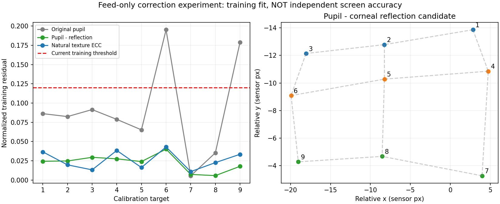
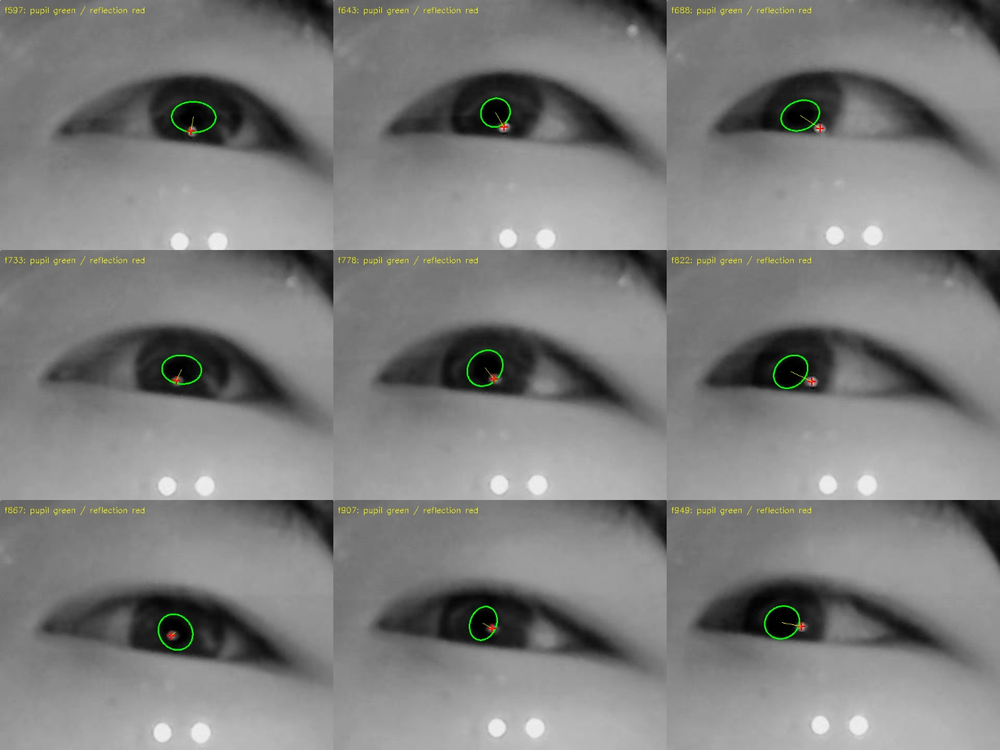
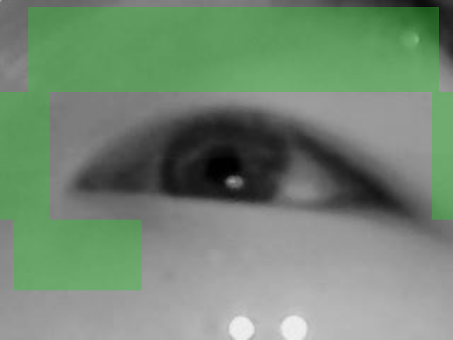

# 현재 눈 카메라 영상만으로 보정하는 방법 — 2026-10-02

조건: 부착 마커·추가 카메라·추가 광원 없이 제공된 눈 영상만 사용한다. 기존 9점 회귀를 유지한 오프라인 실험이며 실행 서버는 변경하지 않았다.

**정정 — 사용자는 반사가 안경에서 생긴다고 설명했다. 이 영상의 밝은 점을 각막 반사라고 확인한 근거가 없으므로, PCCR 우선 적용 제안을 철회한다. 반사 실험 수치는 이 녹화의 상관관계만 보여주며 안경 없는 관람객에게 일반화할 수 없다. 전시용 권고는 [일반 눈 구조·사용자별 기준·반사 없는 상대 보정 조사](EXHIBITION_ROBUSTNESS_20261002.md)로 갱신했다.**

아래는 정정 전 후보 비교의 실험 기록이다. 자연 무늬 정합도 한 사람·수동 마스크 결과이므로 사용자 일반화의 증거로 사용하지 않는다.

## 실제 영상에서 시험한 결과

`20261002T071853Z-0058e7f6`의 원래 동공 검출을 그대로 사용했다. 눈 아래 큰 두 밝은 원형 영역은 이번 두 방법에 사용하지 않았다. PCCR은 동공 옆 작은 반사 후보만 사용하고, 영상 정합은 동공·중앙 눈꺼풀·영상 하단의 큰 밝은 영역을 제외한다.

| 입력 | 최대 9점 학습 잔차 | 한 점 제외 재학습 최대 오차 | 점별 사용 표본 |
|---|---:|---:|---|
| 원래 절대 동공 중심 | 0.19517 | 0.94790 | 24,24,23,23,24,23,21,13,24 |
| PCCR, 밝기 임계값 130 | **0.04012** | **0.12399** | 17,24,23,23,24,23,15,13,24 |
| PCCR, 임계값 140 | 0.04228 | 0.15216 | 16,24,23,23,23,23,12,13,24 |
| 자연 무늬 ECC 평행이동 정합 | **0.04300** | 0.18975 | 원래 표본 모두 |

PCCR 임계값 120에서도 학습 최대 오차는 0.04263이었다. 개선이 특정 임계값 하나에서만 나타난 것은 아니다. 130의 정확히 같은 프레임 집합으로 원래 절대 동공 중심을 학습하면 최대 오차가 0.19548이다. 누락 프레임을 빼서 우연히 좋아진 결과로만 설명되지는 않는다.

**모두 학습 잔차이며 1→9→4 성공 결과가 아니다.** 이 기록에는 별도 4점 검증 관측이 없다. 원래 동공 검출의 flow 보완 표본도 유지했다. 특히 8번 점은 새 동공 검출 4개와 flow 보완 9개라는 문제가 그대로 남는다. 실제 검출만 요구하면 수집 시간을 늘려야 한다. 반사점의 정답 라벨·광원 식별·수동 동공 정답도 없다.



## 1. 반사 후보 차분: 전시용 기본 경로에서 제외한 실험

현재 IR 영상에는 동공 옆에 작은 밝은 반사가 이미 보인다. 이 반사를 각막 반사점 후보로 검출하고 `동공 중심 - 반사점 중심`을 9점 회귀의 2D 입력으로 사용한다. 작은 공통 영상 이동이 두 좌표에 함께 들어오면 차분에서 상쇄된다. 반사는 안구 회전 때도 완전히 고정되는 점은 아니므로 새 입력으로 다시 보정해야 한다.

이 방법은 실제 eye tracker에서 사용하는 P–CR 방식과 같은 기본 원리다. 작은 머리 이동을 부분적으로 보상할 수 있지만 큰 이동에서 정확도가 떨어진다는 점도 연구에서 명시한다. [RELAY 논문, P–CR 설명](https://pmc.ncbi.nlm.nih.gov/articles/PMC11946672/). HMD에서의 pupil–glint 설계와 알고리즘도 연구되어 있다. [Hua 등, Optics Express 2006](https://experts.arizona.edu/en/publications/video-based-eyetracking-methods-and-algorithms-in-head-mounted-di/).

이번 최소 실험은 320×240 원영상에서 동공 주변 35px 내 작은 밝은 연결 영역을 찾았다. 면적 2–80px, 가로/세로 최대 14px, 동공 중심과 거리 28px 미만을 검사하고 중심을 구했다. 실제 동공 주변 반사를 고르는지 대표 9개 프레임을 시각적으로 확인했다. 영상 하단 영역은 검색하지 않는다.



실시간 적용에서 필요한 practice:

- 매 프레임 가장 밝은 점을 독립적으로 선택하지 않는다. 동공 주변의 후보 크기·형상·상대 위치와 이전 반사 패치를 함께 검사해 같은 광원의 반사인지 유지한다. 여러 반사와 눈꺼풀 반사가 나타나면 확실한 후보만 채택한다.
- 밝기 임계값을 장시간 고정하는 대신 국소 배경 대비를 사용하고, 작은 패치 안에서 밝기 가중 중심/피크 피팅을 비교한다. 센서 1px 오차의 영향이 크므로 원영상 좌표에서 subpixel 위치를 계산한다.
- 반사 때문에 동공 경계가 잘린 구간은 동공 타원 피팅에서 제외한다. 반사 중심을 찾는 작업과 가려진 동공 중심을 복원하는 작업을 구분한다.
- 반사 후보를 놓치면 오래된 반사점과 새 동공을 빼지 않는다. 해당 표본을 무효 처리하고 재획득을 확인한다. 보정·검증에서는 새 동공 경계와 반사점이 모두 관측된 표본을 요구한다.
- 크기 정규화가 필요하면 눈꼬리 사이 거리처럼 시선 변화에 덜 민감한 관측을 별도 검증한다. 동공 지름은 실제 생리 변화가 있으므로 무조건 나누지 않는다.

노이즈·가짜 반사에 경험적 임계값이 한계에 도달하면 **LEyes**가 구체적인 학습 기반 후보다. 합성 영상으로 동공과 각막 반사를 학습하며, 다중 반사의 광원 대응과 누락도 다룬다. 공개 모델/코드가 있지만 이번 카메라에서 실행·정확도 평가한 것은 아니다. [LEyes 논문](https://link.springer.com/article/10.3758/s13428-025-02645-y), [공개 구현](https://github.com/dcnieho/Byrneetal_LEyes).

## 2. 자연 무늬 영상 정합: 반사를 쓰지 않는 대안

기존 피부 LK는 특징점 10개 이상을 요구해서 이번 영상에서 거의 작동하지 않았다. 눈 바깥의 저대비 무늬를 영상 전체의 밝기 패턴으로 비교하는 **ECC 정합**은 별도 라이브러리 없이 현재 OpenCV에 있다. 평행이동·회전·affine 모델을 지원한다. 이것은 OpenCV가 제공하는 일반 영상 정합 기능이며 검증된 전용 eye-tracking 보정기로 주장하지 않는다. [OpenCV 공식 API](https://docs.opencv.org/4.x/dc/d6b/group__video__track.html).

두 번째 보정의 중앙 주시 중인 560번 프레임을 기준 영상으로 잡았다. 상부 피부/머리카락 무늬와 측면·왼쪽 아래 피부 일부만 마스크로 사용했다. 중앙 눈 영역과 눈 아래 두 큰 밝은 점을 제외했다. 이후 420프레임을 같은 기준 영상에 정합하여 위치 이동을 빼고 원래 동공 좌표를 다시 학습했다. 420개 모두 ECC score >0.8였고 9점 수집의 원래 유효 표본을 모두 유지했다.



이번 실행의 처리 시간은 중앙 약 4–5ms, p95 약 21ms였다. 알려진 ±3px 영상 평행이동 네 조건에서는 이동 추정 오차가 0.08–0.70 센서 px였다. 같은 시험에서 PCCR 특징은 주어진 정확한 동공 중심을 함께 이동시키면 상대 좌표를 그대로 유지했다. 이 합성 시험은 **특징 계산과 정합**의 검사이며 동공 검출부터 포함한 전체 시선 정확도 시험은 아니다.

실시간 적용에서 필요한 practice:

- 동공·홍채와 중앙 눈꺼풀을 움직임 기준에서 제외한다. 영상 전체를 정합하면 실제 안구 회전을 카메라 이동으로 오인할 수 있다.
- 프레임 간 이동을 무한히 더하지 않는다. 중앙 1점에서 실제 기준 영상을 확보하고 주기적으로 같은 기준에 정합해 누적 drift를 검사한다. 기준을 바꿀 때 기존 좌표계와 연결을 확인한다.
- 처음에는 평행이동만 시험한다. 실제 회전/거리 변화 데이터가 확보되면 회전·scale이 포함된 similarity 또는 affine을 비교한다. 학습 잔차만 보고 자유도를 늘리지 않는다.
- 서로 떨어진 자연 무늬 패치들의 추정이 일치하는지, 역방향 정합이 일치하는지 확인한다. correlation이 높다는 이유만으로 정확한 이동이라고 간주하지 않는다.
- 상부 눈썹/피부도 표정에 따라 변형된다. 패치별 이동이 충돌하면 실제 기준 이동을 관측하지 못한 것으로 처리한다.

눈꼬리는 자연 기준점으로 쓸 수 있는 다른 선택이다. 2024년 연구는 눈꼬리의 2D 이동으로 머리 움직임에 따른 시선 오차를 별도 회귀해 줄였다. 다만 해당 연구는 다른 촬영·학습 조건이며, 현재 카메라에서 바로 같은 정확도가 나온다고 볼 수 없다. [Banks 등, eye-corner compensation](https://pubmed.ncbi.nlm.nih.gov/38888820/).

## 3. Glint-free 3D/Grip practice

**pye3d**는 고품질 동공 타원을 시간에 걸쳐 모아 눈 카메라 좌표계의 안구 위치를 추정하고, 최근 관측으로 gaze direction을 계산한다. 장·단기 모델을 이용해 headset slippage에 대응한다. 현재 이미 설치된 경로가 있으므로 새 구현보다 이 경로를 비교하는 것이 작다. 대신 잘못된 타원을 3D에 넣어도 근본 문제가 없어지지 않는다. 정확한 3D 비교에는 카메라 내부 파라미터와 다양한 동공 관측 방향을 확인해야 한다. [pye3d 공식 문서](https://docs.pupil-labs.com/core/developer/pye3d/).

**Grip**은 추가 glint나 stereo eye camera 없이 head-mounted tracker의 slippage를 보상하는 연구다. 저자들은 EyeRecToo에 reference implementation을 통합했다고 보고한다. 하지만 이번에 열어본 GitHub mirror의 gaze-estimation 폴더는 Homography/PolyFit만 보여 최신 Grip 코드를 직접 검증하지 못했다. 다른 `eyerec` 저장소 README에서도 Grip은 TODO다. “지금 Python 패키지를 설치하면 바로 된다”는 상태로 소개하지 않는다. [Grip 저자 소속 기관의 논문 설명](https://www.lunduniversity.lu.se/publication/63f2a7f8-f896-4867-a320-c2916183dddf), [확인한 mirror 폴더](https://github.com/tcsantini/EyeRecToo/tree/master/EyeRecToo/src/gaze-estimation), [eyerec README](https://github.com/tcsantini/eyerec).

## 정정 전 제안 — 아래 순서는 현재 권고가 아님

1. 별도 실험 경로에서 **PCCR 입력**을 먼저 사용하고 기존 9점 회귀와 독립 4점 검증을 유지한다. raw의 의미가 바뀌므로 기존 보정을 재사용하지 않는다.
2. 중앙 1점을 실제 기준 수집 단계로 바꾸고, 검출/반사 출처와 유효 관측 나이를 남긴다. 특히 flow-only 표본이 많은 점은 충분한 새 검출이 모일 때까지 수집한다.
3. 자연 무늬 ECC는 별도 입력 경로로 비교한다. PCCR과 ECC의 좌표는 다른 특징이므로 반사가 없을 때 무보정 절대좌표나 ECC 좌표로 조용히 전환하지 않는다. 각각 검증된 mapping이 필요하다.
4. 네 개의 독립 검증점과 같은 목표 재주시에서 오차·jitter·누락·재획득 시간을 측정한다. 카메라/눈의 작은 이동 조건에서도 검사한다. 실제 회전·거리 변화와 합성 영상 이동은 별개다.
5. 반사 추적과 자연 기준 추적이 부족한 조건에서 pye3d 또는 학습 기반 feature localization을 비교한다.

카메라가 머리에 고정된 경우에는 눈↔카메라의 slippage와 머리↔화면 자세 변화를 구분해야 한다. 눈 근접 영상만으로 외부 화면에 대한 모든 머리 자세 변화를 관측할 수는 없다. 화면/책상에 고정된 카메라는 자연 기준과 광학 모델의 적용 조건이 또 달라진다. 여기서 확보한 근거는 이번 영상의 상대 이동 보정과 9점 관계 개선이다.

재현:

```sh
camera_accuracy/.venv/bin/python camera_accuracy/diagnostics/markerless/practice.py \
  /Users/chanwoo/Downloads/20261002T071853Z-0058e7f6
```

수치와 알려진 이동 검사: [results.json](diagnostics/markerless/results.json). 실험 코드: [practice.py](diagnostics/markerless/practice.py). 서버/실시간 tracker는 이번 조사에서 수정하지 않았다.
