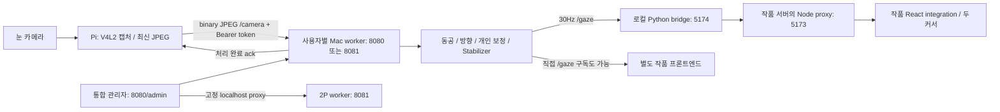

# 저장소·연결 파이프라인 audit 및 IMU 확장안

검토일: 2026-10-02. 대상은 현재 checkout의 `exhibition/`, 루트 실행·설치 스크립트, 연결 관련 문서와 `legacy/`의 실행 경로·의존성이다. `camera_accuracy/`는 읽거나 수정하지 않았다. 운영 코드의 수정, 서비스 재시작, Pi 접속, 배포는 하지 않았다. legacy 알고리즘 전체의 수학적 정확성이나 Unity 장면 실행은 검증 범위에 포함하지 않는다.

현재 Pi–Mac 영상 파이프라인은 유지할 만하다. 우선 해결할 것은 실행본과 저장소의 불일치, 프레임 freshness, bridge Origin 검사, 자동실행 재설치 실패다. IMU 확장의 핵심은 **카메라·IMU·관람객 세션의 수명을 분리하면서, 작품에는 선택된 커서 좌표를 계속 같은 경로로 전달하는 것**이다.

## 1. 실제 연결 구조



마지막 Node/React 단계는 현재 저장소에 일부 연결 모듈만 존재한다. 위 도식은 코드가 의도하는 구조이며, 현재 checkout만으로 모든 단계를 실행할 수 있다는 뜻은 아니다.

| 구간 | 현재 동작 | 판단 |
|---|---|---|
| 카메라 → Pi | 캡처 스레드, 최신 JPEG 하나 보관, MJPEG 직송 우선·인코딩 fallback | 유지 |
| USB 복구 | UVC capture node 탐색, stable alias/identity 유지, 다른 카메라로 무단 전환 방지 | 유지 |
| Pi → Mac | 프레임 하나 전송 후 처리 ACK 대기, ACK 3초 제한, 재시도 2초 | 최신 프레임 정책 유지 |
| Mac 사용자 분리 | 별도 프로세스·트래커·보정·토큰·필터 | 유지 |
| Mac → 작품 | 정규화 x/y, valid, user_id, session_id; 무효 시 null | 계약을 확장할 출발점 |
| 운영 API | Mac localhost 제한, Pi Basic 인증, POST Origin 검사 | bridge WS 검사 보완 필요 |
| 영상 미리보기 | Pi/worker JPEG snapshot을 HTTP로 반복 조회 | 실시간 연속 영상 플레이어가 아니라 진단용 snapshot |
| 장애 복구 | Pi systemd watchdog, Mac LaunchAgent 재시작 | worker 프로세스 장애는 전체 전시로 전파됨 |

Pi의 latest-only 구조는 앱 수준 대기열 누적을 억제한다. 실제 USB 드라이버 버퍼·Wi-Fi·TCP 지연까지 제거하거나 전체 촬영 지연을 보장하지는 않는다. 30Hz `/gaze` 전송도 30 FPS 추론을 의미하지 않는다. `seq`는 처리 결과마다 증가하며 한 결과가 여러 번 발행될 수 있다.

## 2. 우선순위별 발견 사항

P1은 전시 재현·복구 또는 신뢰 경계에서 먼저 고칠 문제, P2는 연결 안정성과 팀 호환성을 위해 보완할 문제다.

### F1 · P1 · 실행 스크립트와 저장된 프론트엔드가 불일치

근거: `exhibition/scripts/start-mac.sh:68`, `exhibition/frontend-integration/useComputeGaze.js:3`.

기본 launcher는 `exhibition/frontend-example/server.js`를 실행한다. 그러나 Git 추적 파일과 로컬 폴더에는 `server.js`, `package.json`, `src/shared/gaze/participants`가 없다. 있는 것은 정적 `index.html/app.js/style.css/flow.js`다. React 연결 모듈은 존재하지 않는 `participants`를 import한다. Python bridge는 정적 작품을 서비스하는 구현도 아니다.

따라서 현재 기본 설정의 새 checkout으로는 문서에 적힌 Next 작품을 재현할 수 없다. 현장 실행이 된다는 관찰과 모순되는 것은 아니다. Library 설치본, 별도 프론트 저장소, 외부 작품 URL 설정 중 어느 경로로 운영하는지 대조해야 한다. 이번 audit에서는 운영 설치본을 읽거나 변경하지 않았다.

권장: 별도 팀의 프론트 저장소·고정 revision·실행 계약을 명시하고, 이 repo는 compute와 integration의 소유권을 확정한다. 작품을 계속 별도로 관리한다면 없는 내장 Next 프로젝트를 기본 실행 전제로 삼지 않는다. 정적 데모를 유지한다면 이를 실제로 실행하는 경로 하나만 제공한다.

### F2 · P1 · 자동실행 재설치가 읽기 전용 Node 바이너리에서 실패

근거: `exhibition/autostart.py:58–63`, `exhibition/autostart.py:115–117`.

`shutil.copy2`가 Node 원본의 권한까지 보존한다. 이 환경의 Homebrew Node는 실제 파일 권한이 `0555`다. 최초 복사한 설치본도 쓰기 권한이 없어서 두 번째 설치 때 같은 파일을 덮어쓰다가 `PermissionError`가 발생한다. 임시 설치 대상으로 수행한 기존 두 autostart 테스트에서 재현됐다.

더 큰 영향은 재설치가 기존 LaunchAgent를 먼저 중지한 다음 deploy한다는 점이다. 이 오류가 나면 서비스가 중지된 채 남을 수 있다.

권장: 바이너리를 임시 파일에 복사 후 교체하고, 배포본 검증 뒤 서비스 전환을 수행한다. 소규모 수정으로 해결할 문제이며 새 배포 프레임워크는 필요하지 않다. 실제 설치된 Node가 항상 이 권한이라는 뜻은 아니며, 이 권한인 원본에서 재설치가 실패한다는 의미다.

### F3 · P1 · 느린 프레임이 최신 입력으로 표시됨

근거: `exhibition/mac.py:78–88`, `exhibition/mac.py:129–131`, `exhibition/mac.py:361–364`.

`received`는 수신 시각이 아니라 추론을 끝내고 `accept()`한 시각이다. `frame_age_ms`와 350ms stale 판정이 모두 이 값에 의존한다. 600ms 걸리는 가짜 트래커로 실제 JPEG WS 경로를 재현했을 때:

```text
전송 → ACK 경과: 618ms
packet.frame_age_ms: 4ms
packet.valid: true
```

느린 프레임을 짧게라도 유효한 최신 좌표로 취급하게 된다. Pi JPEG에는 capture timestamp나 frame sequence도 포함되지 않아 capture-to-display 지연을 계산할 수 없다.

권장: 우선 Mac 수신 monotonic 시각부터 처리 완료까지의 시간도 freshness에 포함한다. 진정한 capture age는 Pi capture timestamp/sequence를 운반하는 프로토콜을 추가하고 기기 간 시계 오차를 다루어야 한다. Pi·Mac의 monotonic 값을 그대로 빼면 안 된다. 발행 `timestamp_ms`는 샘플 시각과 구분한다.

### F4 · P1 · Python bridge WS가 외부 Origin을 검사하지 않음

근거: `exhibition/frontend.py:17–21`, `exhibition/frontend.py:75–91`.

bridge는 localhost remote/Host를 확인하지만 Origin 검사는 GET 이외 요청에만 적용한다. WS handshake는 GET이다. `/gaze`는 전달받은 Origin 대신 자체 worker Origin과 저장된 구독 토큰으로 upstream에 연결한다.

worker에서 구독 토큰 요구를 켠 뒤에도 bridge에 `Origin: http://foreign.example`로 WS 연결하면 `gaze` 메시지를 받을 수 있음을 임시 서버에서 재현했다. Node proxy의 Origin 검사는 직접 5174에 접근하는 경로를 막지 못한다. 브라우저의 로컬 네트워크 접근 정책에 따라 실제 외부 웹페이지의 접근 여부는 달라질 수 있지만 서버 검사 누락은 존재한다.

권장: bridge의 WS handshake에서도 신뢰하는 Origin을 검사한다. localhost 바인딩만으로 브라우저 Origin 신뢰를 대신하지 않는다. 쓰기 API의 현재 Origin 검사와 고정 upstream allowlist는 유지한다.

### F5 · P2 · 관리자 보정과 작품 보정의 완료 조건이 다름

근거: `exhibition/web/index.html:77–87`, `exhibition/mac.py:479–500`.

관리자의 사용자별 보정 화면은 9점 뒤 중앙 한 점만 검사하고 `viewport`를 보내지 않는다. 작품 integration은 9점 뒤 독립 3점 검증과 viewport를 사용한다. 서버는 `validation_index`가 없으면 중앙 한 점 검증으로도 보정을 완료한다.

둘 다 API상 성공하지만 “보정 완료”의 의미와 화면 크기 검사가 다르다. 관리자에서 보정한 뒤 작품 창이 다르더라도 `calibration_viewport=null`이면 좌표 helper는 크기 불일치를 검사할 수 없다.

권장: `/api/calibration-plan`을 사용하고 모든 운영 보정 경로에서 viewport와 같은 검증 단계를 적용한다. 기존 중앙 검증을 의도적으로 유지한다면 간이 점검임을 구별한다. 시선 추정 알고리즘 변경과는 독립적인 작업이다.

### F6 · P2 · React integration의 stale 제거가 HTTP polling 완료를 기다림

근거: `exhibition/frontend-integration/useComputeGaze.js:84–100`.

WS 메시지가 멈췄지만 소켓 close는 아직 발생하지 않았을 때 커서 제거는 status fetch가 끝난 뒤 수행된다. 브라우저 요청 자체에는 별도 timeout이 없으며 Node proxy timeout은 15초다. bridge는 upstream HTTP timeout 5초를 사용한다. 장애 위치에 따라 약속한 350ms보다 오래 마지막 좌표가 남을 수 있다.

권장: 입력 무응답 watchdog을 WS 수신 시각 기준의 독립 timer로 둔다. HTTP 상태 조회는 진단만 담당한다. 일반 `gaze-client.js`에는 이미 별도 500ms watchdog이 있으므로 같은 패턴을 사용하고 timeout 계약을 통일한다.

### F7 · P2 · 테스트가 실제 프론트 실행 경로를 덮지 않음

근거: `exhibition/tests/test_frontend.py:22–35`, `exhibition/tests/test_install.py:24–46`.

보정 flow 테스트는 현재 파일 대신 `legacy/frontend-example/flow.js`를 읽는다. 두 파일은 현재 동일하지만 이후 수정은 테스트에 반영되지 않는다. Next proxy 테스트는 없는 `node_modules/ws` 때문에 skip된다. launcher 테스트의 가짜 Python은 모든 `-c`에 성공을 반환해 Node 작품 분기까지 들어가지만 가짜 Node 작품은 준비하지 않는다. 기본·two-users·simulate 세 subcase가 실패했다.

권장: 현재 소유 모듈을 직접 테스트하고, 실행 테스트는 실제 지원 구성에 맞춰 가짜 작품 프로세스도 준비한다. 프론트 계약 테스트가 항상 skip된 상태로 릴리스하지 않는다. 현재 React hook의 무응답·입력 전환 동작도 검증 대상이다.

### F8 · P2 · 트래커 상태는 분리됐지만 프로세스 장애 복구는 전체 단위

근거: `exhibition/scripts/start-mac.sh:51–55`, `exhibition/scripts/start-mac.sh:73–79`.

Pi 한 대의 연결 단절은 해당 worker 상태만 초기화하며 다른 사용자의 보정은 유지된다. 반면 worker 하나나 내장 작품/bridge 프로세스가 종료되면 launcher는 둘 다 종료한다. LaunchAgent는 전체를 재시작하므로 정상 사용자도 보정을 잃는다. 현재 의도된 fail-fast 설계이고 상태 혼선 방지에는 유리하지만, 프로세스 수준 장애 격리는 아니다.

권장: 전시에서 한 관람객의 계속 참여가 필수일 때 사용자별 restart로 바꾼다. 그 요구가 없다면 지금 구조를 유지하고 전체 재보정이 운영 비용임을 명시한다.

## 3. 구조 평가

| 영역 | 평가 / 최소 정리 |
|---|---|
| 루트 launcher | 얇은 wrapper로 적절함 |
| `pi.py` | 캡처와 네트워크가 스레드/async task로 나뉘어 있음. IMU는 같은 캡처 스레드에 넣지 않음 |
| `mac.py` | 추론·보정·API·발행이 한 파일에 있지만 현재 규모에서 전체 분해는 불필요. 입력 선택과 관람객 상태만 분리할 가치가 있음 |
| `common.py` | 원자적 설정 교체와 0600 권한은 적절. config 파일 로드에는 API와 동일한 검증이 적용되지 않음; 설정을 외부 도구로 편집할 경우 startup validation 보완 |
| `tracking/` | 전역 상태를 사용자별 프로세스로 격리하고 headless loader로 호출. 유지하되 IMU를 트래커 전역에 끼워 넣지 않음 |
| `frontend-integration/` | compute 소유 경계로 적절. 다만 작품 내부 `participants` import가 팀 코드 구조에 결합됨. 공개 prop/계약 또는 작은 고정 참가자 mapping으로 경계 명확화 |
| `web/`와 `frontend-example/` | 여러 보정·클라이언트 경로가 존재하며 계약이 갈라짐. 작품 UI 통합보다 보정 plan·freshness 계약부터 통일 |
| 문서 | 루트 README/구조 문서/예시 README/통합 README에 정적 작품과 Next 작품 설명이 섞임. 실제 운영 경로 하나를 기준으로 링크하고 계약 문서를 단일 기준으로 삼음 |
| `legacy/` | 과거 MJPEG·SSE·파일 기반 Unity·웹캠 head tracker가 보존됨. 현재 서비스는 이 경로를 사용하지 않음. 하드코딩 Windows 경로와 GUI 의존성을 현재 배포에 끌어오지 않음 |
| 루트 `3DTracker/`, `tests/` | 현재 로컬에는 pycache만 남음. 실행 코드가 아니며 대규모 정리 대상도 아님 |

새 message broker, 공통 sensor plugin framework, 별도 DB, 전체 디렉터리 재구성은 지금 필요하지 않다. 이미 있는 worker·WS·관리자·프론트 bridge를 확장하는 것으로 충분하다.

## 4. IMU가 들어오면 필요한 시스템 경계

현재는 `camera_connected`, `ready`, `calibrated`, `frame_age_ms`, `session_id`가 눈 입력과 결합돼 있다. `/camera`는 TEXT를 받으면 연결을 닫고, Pi sender는 카메라 프레임이 있어야 접속한다. 여기에 IMU JSON을 그냥 끼워 넣으면 동작하지 않고, JPEG 처리 ACK에 IMU가 묶이면 fallback도 눈 추론을 기다리게 된다.

최소 권장 구조:

```text
RPi camera task ── 기존 /camera JPEG WS ──→ gaze 상태
RPi IMU task    ── 독립 /imu JSON WS   ──→ imu 상태
                                            ↓
                                  사용자별 Mac 입력 선택
                                  + 관람객 lifecycle
                                            ↓
                       기존 작품 /gaze: 선택된 x/y/valid
```

`/imu`는 새 endpoint 제안이며 현재 구현돼 있지 않다. 같은 사용자별 worker에 연결하고 우선 기존 기기 인증 토큰을 재사용할 수 있다. 영상의 지원 기기와 IMU sender가 같은 사용자에 속하는지 검증하고 두 번째 센서 연결을 거부한다. 카메라 분리·USB 읽기 실패·재보정이 IMU 수신을 종료하면 안 된다.

IMU hardware read는 카메라 thread와 독립시키고 최신 샘플을 전송한다. 카메라 native read가 영구 정지하면 현재 watchdog은 Pi 프로세스 전체를 재시작하므로 그 순간 IMU도 끊길 수 있다. 처음에는 재시작 동안 `valid=false/unknown`으로 안전하게 처리하고, 실제 운영에서 장시간 fallback 지속이 필요하면 capture 프로세스만 분리한다.

센서 JSON에는 protocol version, device boot/session ID, sample sequence, capture time, 가속도·각속도·자기장 또는 orientation, 센서 상태를 명시한다. 단위·축 방향·quaternion 순서는 문서로 고정하고 유한수·벡터 길이·norm·크기·rate를 수신 경계에서 검사한다. 값이 오래됐거나 I2C가 멎으면 마지막 자세를 계속 유효 처리하지 않는다. IMU sample rate와 WS publish rate는 실제 장비 성능으로 결정한다.

## 5. 관리자 입력 전환과 head cursor

첫 단계는 사용자별 **수동 `gaze` / `imu` 선택**과 **IMU 정면 기준 저장**이다. `auto`는 실제 장애·복귀 기준을 측정한 다음 추가한다. 두 입력의 좌표를 평균내는 방식은 권장하지 않는다. IMU는 머리 자세 기반 포인팅이고 눈 시선과 제어 방식이 다르다.

IMU cursor에는 mounting axis/sign, 정면 orientation, 수평·수직 이동 각도 범위 또는 gain, deadzone, smoothing을 보정 가능하게 둔다. 초기에는 기준 자세 대비 yaw/pitch를 0–1 좌표로 매핑하는 것으로 충분하다. 가속도 이중 적분으로 머리 위치를 추정하는 기능은 필요하지 않다. yaw wrap, 센서 재부팅, 착용 방향 변경, 자기장 영향, drift를 처리하고 중앙 재설정을 제공한다.

SparkFun 9DoF라는 이름만으로 칩은 확정되지 않는다. 공식 제품에 [ICM-20948](https://www.sparkfun.com/sparkfun-9dof-imu-breakout-icm-20948-qwiic.html)과 [LSM9DS1](https://www.sparkfun.com/sparkfun-9dof-imu-breakout-lsm9ds1.html)이 있다. 정확한 모델·배선·RPi 접근 라이브러리는 구현 전 확정해야 한다. ICM-20948용 SparkFun Arduino 라이브러리는 DMP quaternion 출력을 문서화하지만, 그 기능이 선택할 RPi Python 드라이버에서도 바로 사용 가능하다고 가정하면 안 된다. [SparkFun DMP 문서](https://github.com/sparkfun/SparkFun_ICM-20948_ArduinoLibrary/blob/main/DMP.md).

전환 시에는 이전 입력의 filter와 작품 dwell을 초기화한다. 실제 눈 보정은 유지할 수 있어야 gaze로 복귀할 때 불필요한 재보정을 피한다. `Runtime.reset()`은 눈 모델까지 지우므로 입력 전환용 reset으로 그대로 사용하지 않는다. 관람객 교체 시에는 눈 보정과 IMU 정면 기준을 모두 새로 수집한다.

`auto`를 추가할 경우 blink 한 번에 전환하지 않도록 실패 지속 시간과 복귀 안정 시간을 각각 둔다. 센서 freshness와 cursor 준비 상태를 확인하고, 임계값은 현장 튜닝값으로 둔다. 형태 confidence만으로 눈 정확도를 보장할 수는 없으므로 운영자의 수동 override를 유지한다.

## 6. 착용·내려놓기·전시 종료 감지

IMU만으로는 정지한 착용자와 동일 자세로 놓인 장치를 확실하게 구별할 수 없다. 여기서 착용은 측정값이 아니라 **추정 상태**다. 정지 시간만으로 세션 종료를 판정하면 관람 중 조용히 서 있는 사람도 종료된다.

최소 상태는 `unknown`, `resting`, `wearing_candidate`, `active`, `removal_candidate`, `ended` 정도면 충분하다. 이는 제안이며 현재 구현된 상태가 아니다.

| 관찰 | 처리 |
|---|---|
| 보관 받침대의 알려진 자세·중력 방향 + 낮은 움직임이 지속 | resting 후보. 실제 받침대와 장착 방향 기준으로 보정 |
| 받침대에서 들어 올리는 움직임 | 착용 후보. 자동 참여 확정과 구별 |
| 착용 확인 또는 복수 신호로 확인 + 선택 입력 준비 | 해당 사용자 세션 active |
| active 뒤 장치 내려놓기 움직임 + 보관 자세·정지가 지속 | removal 후보 → 안정 확인 후 해당 사용자 ended |
| 눈 잠깐 감김 / 센서 무응답 / Wi-Fi 단절 | 입력 무효 또는 unknown. 종료로 단정하지 않음 |
| 애매한 자세 / 다시 움직임 | 후보 상태 취소. 관리자 확인 허용 |

눈 영상의 동공 유무는 보조 증거로 쓸 수 있지만 IMU fallback 중 눈 검출을 필수 조건으로 만들지 않는다. 실제 착용 판정 신뢰도가 중요하면 접촉·근접 센서나 받침대 감지 같은 독립적인 증거를 추가한다. 센서 추가 전에는 관리자·작품의 명시적 착용 확인을 유지한다.

종료 이벤트는 한 관람객 세션에서 한 번만 발생하고, 재연결 시에는 현재 상태 snapshot을 받아 복원한다. 지속적으로 `ended` 패킷을 받을 때마다 작품 초기화나 참여 기록 저장을 반복하면 안 된다. 1P 종료와 전체 작품 종료도 구별한다. 전체 작품이 언제 종료되는지는 프론트팀이 정할 정책이다.

## 7. 프론트팀과 고정할 계약

기존 `/gaze?user_id=1|2`, `type:'gaze'`, `version:1`, `user_id`, 정규화 `x/y`, `valid`를 유지하는 확장이 수정량이 작다. 다만 IMU에서도 기존 필드 의미가 자동으로 호환되지는 않는다. 원래 gaze-specific metadata와 선택된 cursor 상태를 구별해 문서화한다.

다음은 협의용 예시이며 아직 구현된 API가 아니다.

```json
{
  "type": "gaze",
  "version": 1,
  "user_id": 1,
  "session_id": "existing-gaze-calibration-session",
  "seq": 123,
  "valid": true,
  "x": 0.51,
  "y": 0.48,
  "frame_age_ms": 18,
  "input_source": "imu",
  "cursor_epoch": 2,
  "participant_session_id": "visitor-session",
  "participant_state": "active",
  "participant_state_seq": 3
}
```

- `valid/x/y`: 선택된 입력으로 작품 interaction에 사용할 수 있는 좌표. 둘 다 무효이면 `false/null/null`.
- `input_source`: 실제로 사용한 입력. 관리자가 선택한 mode와 자동 선택 결과를 구별한다.
- `frame_age_ms`: 기존 클라이언트가 이 값을 검사하므로 IMU cursor의 최신 샘플 경과도 호환되게 표현해야 한다. 영상 경과는 별도 `camera_frame_age_ms`, 센서는 `imu_sample_age_ms`로 구분하는 방안을 합의한다. 기존 필드의 의미 변경을 문서 없이 적용하지 않는다.
- `calibrated/ready/tracking/confidence`: 현재는 눈 기반이다. 선택 입력 기준으로 재정의할지 `cursor_ready`, `gaze_calibrated`, `imu_neutral_set` 등을 추가할지 확정한다. IMU를 써도 동공 품질·`direction`을 가짜 눈 데이터로 채우지 않는다.
- 기존 `session_id`는 눈 보정 세션이다. 관람객 세션과 입력 전환 epoch를 분리한다. 프론트는 전환·재보정·관람객 교체 시 dwell을 초기화하고, 반복 packet만으로 종료 처리를 반복하지 않는다.
- `camera_connected=false`여도 IMU 좌표는 유효할 수 있다. 작품의 참가 가능 조건·진단 UI·보정 진입을 camera-only 기준에서 바꾼다. 현재 `beginCalibration()`은 camera-connected 참가자만 포함한다.
- 관리자의 입력 mode 설정은 관리자 API에만 추가한다. 작품 proxy에 기기 토큰/전체 config 쓰기 권한을 노출하지 않는다. 작품에는 상태·좌표·참여/종료 계약만 전달한다.

프론트팀 전달물은 endpoint와 JSON 필드 목록뿐 아니라 **IMU만 연결된 상태, 전환, 둘 다 끊김, 내려놓기, 재착용**의 예시 packet과 기대 동작이어야 한다. 연결 adapter에서 처리하면 작품 장면을 광범위하게 수정할 필요는 줄어든다. 실제 팀 장면 코드는 이 checkout에 없어 그 호환성까지 확정할 수 없다.

## 8. 구현 순서와 검증

1. 실제 운영 프론트 경로·revision을 확정하고 F1/F2/F3/F4를 보완한다. 보정 계약과 현재 소유 모듈 테스트도 맞춘다.
2. 정확한 IMU 모델 확인 → RPi 독립 수집/전송 → Mac freshness/단위/축 검증. 카메라 없이도 수신 가능하게 만든다.
3. 사용자별 수동 gaze/imu 전환, IMU 정면 기준·감도 보정, 같은 좌표 endpoint로 작품 연결.
4. 실제 착용·내려놓기 로그를 수집해 lifecycle을 구현하고 관리자 override와 사용자별 종료 이벤트를 연결한다.
5. 측정 결과가 있을 때 auto fallback과 복귀 hysteresis를 추가한다.

필수 검증 시나리오: 카메라만 단절해도 IMU 유지, IMU만 단절하면 무효·gaze 영향 없음, old/replayed/nonfinite 센서 샘플 거부, 센서 재부팅 후 새 boot ID 처리, 전환 시 dwell 초기화, 조용한 착용자 비종료, 내려놓기 한 번 종료, 재연결 시 종료 중복 없음, 1P 종료가 2P 세션을 초기화하지 않음, viewport mismatch, 실제 두 Pi 동시 송출과 장시간 전시.

## 9. 이번 검증 결과와 제한

기존 `.venv/bin/python -m unittest discover -s exhibition/tests -v`를 실행했다. sandbox 안에서는 localhost socket bind가 막혀 네트워크 검사가 실패하므로, 허용된 실행으로 다시 수행한 결과를 사용했다.

| 결과 | 내용 |
|---|---|
| 총 40 tests | 34 성공, 2 error, 1 test의 3 subcase 실패, 3 skip |
| 성공 | JPEG ACK·재연결, USB 복구·watchdog, 토큰·Origin·localhost 제한, 사용자 분리, bridge routing, 9점+3점 보정·viewport, 기본 트래커 영상 replay |
| error 2 | autostart 재설치 Node 복사 PermissionError |
| subcase 실패 3 | 기본/two-users/simulate launcher 테스트의 작품 실행 구성 불일치 |
| skip 3 | Next proxy 의존성 없음; Pupil 환경이 없어 실제 Pupil replay/network 2개 skip |
| 추가 재현 | 외부 Origin의 bridge WS 수신; 600ms 추론 결과가 frame_age 4ms·valid true |

Pi 하드웨어, 전시장 Wi-Fi, IMU 실기, 실제 설치본과 별도 프론트팀 프로젝트는 이번에 실행하지 않았다. 위 결과는 현재 코드의 연결 논리와 회귀 검증이지 현재 전시의 실제 지연·시선 정확도·착용 감지 정확도를 보장하지 않는다.
